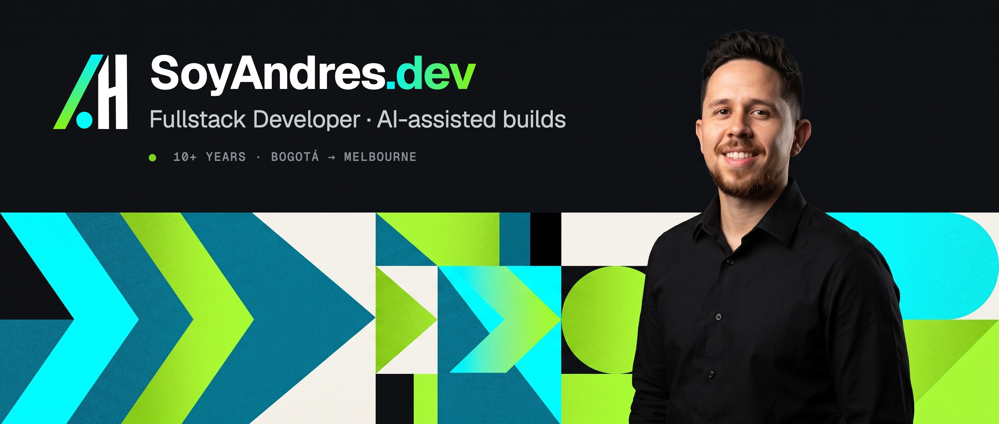

<a href="https://soyandres.dev">
  
</a>

<p align="center">
  <a href="https://soyandres.dev"></a>
  <a href="https://www.linkedin.com/in/soyandreshernandez/"></a>
  <a href="mailto:info@soyandres.dev"></a>
  <a href="https://www.youtube.com/channel/UC1UzYcxIbBgUbiWAKy9rjKg"></a>
  <a href="https://www.instagram.com/soyandydev/"></a>
</p>

## Hi, I'm Andres 👋

I'm a **Fullstack Developer** from Bogotá, Colombia 🇨🇴, and now I live in **Melbourne, Australia** 🇦🇺. I have **more than 10 years** of experience building websites and web apps.

I worked for almost three years as a **Senior Frontend Developer at Mercado Libre**. There, I led the frontend team for the sellers' app. Before that, I worked with React at **Datagran** and **Monoku**.

Now I work as a freelancer. I build complete web products: the frontend with Astro or Next.js, the backend with Node or Nest and PostgreSQL, and I deploy them on AWS. I also use AI in my work. It helps me write repetitive code faster, so I have more time to understand what users really need.

```ts
const andres = {
  based: "Melbourne, AU · GMT+10",
  role: "Freelance Fullstack Developer",
  focus: ["Frontend", "Backend", "AI-assisted workflows", "Design systems", "Performance", "Accessibility"],
  languages: ["Español", "English"],
  status: "available for projects ✅",
};
```

## 🧰 Stack

<p>
  
  <br>
  
  <br>
  
</p>

| | |
| :-- | :-- |
| **Frontend** | React, Next.js, Astro, Tailwind CSS and GSAP. GraphQL and Apollo for complex data |
| **Backend** | Node.js, Express and Nest.js, with PostgreSQL or MongoDB |
| **Testing** | Jest, Testing Library, Cypress and Lighthouse |
| **Deploy** | Docker, AWS and Git. I design in Figma before I write code |
| **AI** | Claude and Gemini to build prototypes faster and find problems early |

## 🚀 Featured projects

<table>
  <tr>
    <td width="50%" valign="top">
      <h3><a href="https://github.com/soyandresdev/seo-rank-tracker">SEO Rank Tracker</a></h3>
      <p>A tool to check the SEO of a website with AI. It opens the page in a real browser, runs 20 checks and uses Gemini to give it a score. An assistant explains what to fix. Every morning it also checks your Google position for each keyword and country, and it sends you an email if something changes.</p>
      <p>
        
        
        
        
        
        
      </p>
      <a href="https://soyandres.dev/projects/seo-rank-tracker">Case study →</a>
    </td>
    <td width="50%" valign="top">
      <h3><a href="https://github.com/soyandresdev/the-frontend-projects">The Frontend Projects</a></h3>
      <p>A collection of frontend projects that I build by hand, from vanilla JavaScript to React and TypeScript. Each project has its own name, design and GSAP animations. All of them live on one Astro website in English and Spanish.</p>
      <p>
        
        
        
        
        
      </p>
      <a href="https://thefrontendprojects.soyandres.dev">Live demo →</a> · <a href="https://soyandres.dev/projects/the-frontend-projects">Case study →</a>
    </td>
  </tr>
</table>

## 🧭 Experience

| Period | Role | Company |
| :-- | :-- | :-- |
| 2023 — Now | Freelance Fullstack Developer | Independent · Melbourne, AU |
| 2020 — 2023 | Senior Frontend Developer | Mercado Libre · Bogotá, CO |
| 2018 — 2020 | Frontend Developer | Datagran · Bogotá, CO |
| 2016 — 2018 | Frontend Developer | Monoku · Bogotá, CO |

See my full experience and certifications at [soyandres.dev/experience](https://soyandres.dev/experience).

## 📊 GitHub stats

<p>
  
  
</p>

---

<p align="center">
  I love clean code, good music and anime 🎧 · <a href="https://soyandres.dev">Let's work together!</a>
</p>
